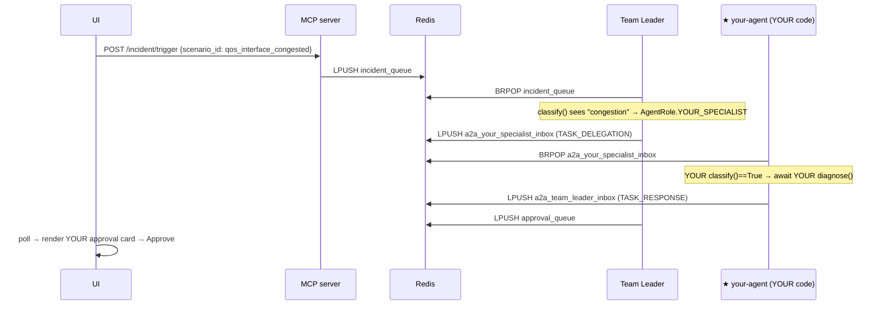

# Lab 3 — Wiring Guide (optional Step 4: make your specialist *run*)

You already wrote `QoSSpecialist.classify()` + `diagnose()` and turned the 4 tests green.
That proves your logic in isolation. **This guide makes it run for real** — the Team Leader
delegates a live QoS incident to *your* agent, and the approval card you see is produced by
**the code you wrote** (not the stub LLM).

> **One canonical role name.** Everything here uses the role that already exists in the enum:
> `AgentRole.YOUR_SPECIALIST = "your_specialist"`. (An earlier draft of the solution notes said
> to rename it to `QOS_SPECIALIST` — ignore that; `YOUR_SPECIALIST` is the slot the scaffold,
> the Team Leader, and the inbox naming all expect.)

---

## Where your agent slots in

```
            ┌───────────────┐  ACP/HTTP
   you ───▶ │  Streamlit UI │ ──POST /incident/trigger──┐
            └───────────────┘                           ▼
                                              ┌───────────────────┐
                                              │   MCP server      │  LPUSH
                                              │  (mock devices)   │ ───────▶ incident_queue
                                              └───────────────────┘              │
                                                                                 ▼
                                            ┌──────────────────────────────────────────┐
                                            │  Team Leader  — classify(incident)        │
                                            │  "qos|congestion|…" ─▶ YOUR_SPECIALIST     │
                                            └───────────────┬──────────────────────────┘
                                       A2A (Redis list)     │  a2a_your_specialist_inbox
                                                            ▼
                                       ┌──────────────────────────────────────┐
                                       │  ★ YOUR agent (services/your-agent)   │
                                       │     classify()  →  diagnose()         │  ← YOUR CODE RUNS
                                       └───────────────┬──────────────────────┘
                                          A2A response │  a2a_team_leader_inbox
                                                       ▼
                              Team Leader ─LPUSH─▶ approval_queue ─▶ UI shows YOUR card ─▶ Approve
```

Every built-in specialist joins exactly this way. You're adding a 6th box that the Team
Leader can route to — **no change to any existing agent.**



---

## The 5 edits

### 1 — Copy the runner + paste in your code
```bash
cp -r labs/lab3_wire_your_own_specialist/wiring services/your-agent
```
Open `services/your-agent/main.py` and replace the two methods in the `YourSpecialist` class
with the `classify()` / `diagnose()` you wrote in `starter/agent_yourname.py`.
*(The file ships with the QoS reference solution already filled in, so it runs even if you skip this.)*

### 2 — The role already exists (no edit)
`services/shared/a2a_protocol.py` already has:
```python
class AgentRole(str, Enum):
    ...
    YOUR_SPECIALIST = "your_specialist"   # ← your agent uses this; inbox = a2a_your_specialist_inbox
```

### 3 — Teach the Team Leader to route to you
In `services/team-leader/main.py`, inside `classify()`, add a branch **before** the default
return:
```python
    if any(k in msg for k in ("qos", "policy-map", "shaping", "congestion")):
        return AgentRole.YOUR_SPECIALIST
```
*(`msg` is the lower-cased `raw_message` — match the existing branches in that function.)*

### 4 — Add your container
In `docker-compose.yml`, copy the `stability-agent:` block and adapt it:
```yaml
  your-agent:
    build:
      context: ./services
      dockerfile: your-agent/Dockerfile
    container_name: ws-c2-your-agent
    environment:
      - REDIS_URL=redis://redis:6379
      - PYTHONUNBUFFERED=1
    depends_on:
      redis:
        condition: service_healthy
    networks: [wsc2]
    restart: unless-stopped
```

### 5 — Give yourself a way to fire a QoS incident
**a)** In `services/ui/app.py`, add a button to the `scenarios` list:
```python
    ("qos_interface_congested", "router-1", "QoS congestion (your specialist)"),
```
**b)** In `services/mcp-server/main.py`, add a line to the `_scenario_to_syslog` table so the
incident carries a QoS keyword the Team Leader can route on:
```python
        "qos_interface_congested": "%QOS-4-CONGESTION: GigabitEthernet0/1 egress drops, child-policy shaping exceeded",
```

### Run it
```bash
docker compose up -d --build
# open the UI, click "QoS congestion (your specialist)"
```
Within a few seconds an approval card appears — **root cause, fix and confidence all came from
your `diagnose()`**. Watch it land: `docker compose logs -f your-agent`.

---

## Why each piece (the mental model)
- **Inbox naming is automatic:** `A2AChannel` builds the inbox as `a2a_{role.value}_inbox`. Because
  your runner sets `role = AgentRole.YOUR_SPECIALIST`, it listens on `a2a_your_specialist_inbox`,
  which is exactly where the Team Leader's delegation lands. Get the role right and the plumbing
  is free.
- **The specialist is pure logic.** No Redis, no protocol code lives in your class — that's why it
  was unit-testable in Lab 3 with no Docker. The runner is the only thing that touches the bus.
- **Your `diagnose()` actually runs.** The built-in specialists fetch their diagnosis from the stub
  LLM; your runner calls *your* method directly. That's the point of the lab — your code, live.

## Common pitfalls
- **No card appears →** Team Leader didn't route to you. Check your Step-3 keyword branch and that
  the syslog from Step 5b contains one of those keywords. `docker compose logs team-leader`.
- **`your-agent` restart-looping →** usually an import error in your pasted code, or a missing key
  in the `diagnose()` return dict (it must have all 5: `root_cause`, `evidence`, `proposed_fix`,
  `risk_assessment`, `confidence`). `docker compose logs your-agent`.
- **Role typo →** if `role.value` ≠ what the Team Leader returns, the delegation goes to an inbox
  nobody is reading. Keep it `your_specialist` on both sides.

This is the *exact* 5-step shape that adds any new specialist to the production stack — only the
specialist's internals (LLM call, KG queries, validation passes) get heavier.
